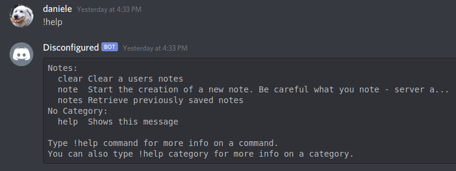
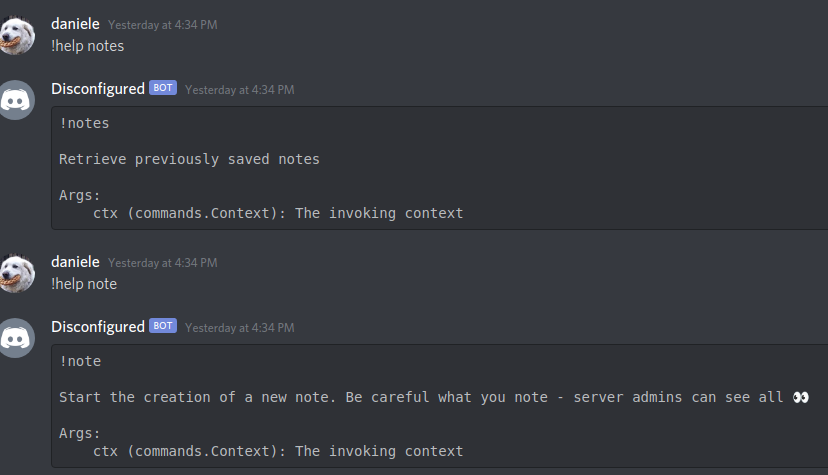
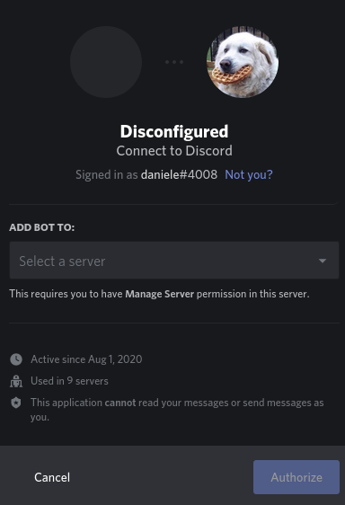
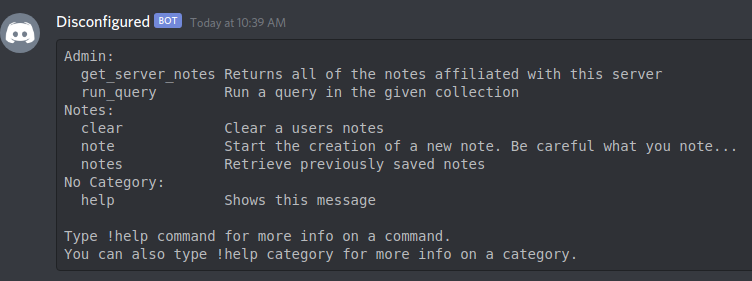
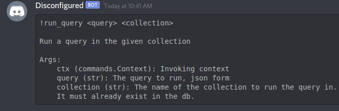
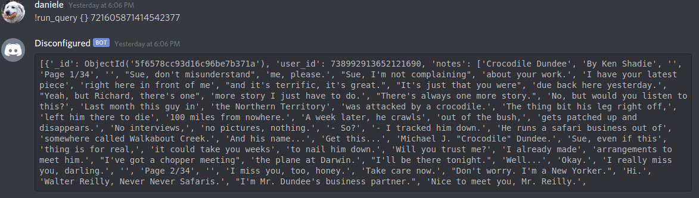
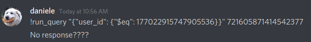
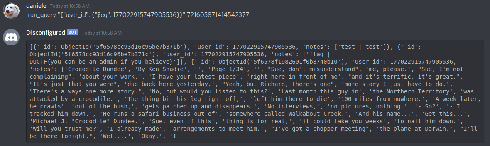

# Disconfigured - Misc
I hope someone told the admins that this bot is for notes and not secrets. Who knows what they might be hiding 👀

Bot: Disconfigured#1791

Author: Delta#5000

# Writeup
There is a discord bot. I slide into its DMs and type !help.




From this, I can tell the bot is written with `discord.py`. I recognize the help message, it is generated automatically by `discord.ext.commands`.

It's weird that `commands.Context` is included in the argument list. `ctx` is kind of like a default parameter used by `discord.py` commands, and it wouldn't normally be listed in the help message. It is used to specify which user sent the message that triggered the command and things like that.

However, this is a dead end. Let's assume that this bot does not implement a custom help command. In this case, if we could modify `ctx`, `!help note` would say `!note <ctx>`. I concluded that the creator just put explained `ctx` in the docstring of the function. The docstring is then used by `discord.py` to generate the command's help function. We cannot actually use it as a parameter of the command. If we could, it would be very hard to do, and I did not feel like trying that. So I went with the assumption; the bot does not have a custom help command.

The only other thing I found suspicious was `server admins can see all`. What exactly does this mean? The author of the challenge specifically? The admins of the DownUnderCTF server? Or... any admin?

### Invite the bot in your own server.
To invite a bot, you need an invite link. At first I had no idea how to do that, but I looked up the invite link of my own bot and found that you simply need the bot's user id, which you obtain by enabling developer tools in Discord and right clicking on the bot -> Copy ID.
Then, take the invite URL of any other bot and simply replace the client_id field.

https://discord.com/oauth2/authorize?client_id=738992913652121690&permissions=0&scope=bot


#### Type !help in your own server and....


Alright, CLEARLY we are on the right path. 
Let's see these new commands. We don't care about `get_server_notes`, in our own server we'll find only notes that are placed by us or by our own teammates. Yes, notes are server-based by the way. You could already verify this by adding a note in DownUnderCTF's server and in your DMs and then using `!notes`, they are seperate.


#### run_query


This was the most painful part for me. I usually do pwn, what the hell are databases? 

Right from the start I assumed that `collection` referred to a Server ID, which you can get by right click -> copy ID on the server icon. This assumption turned out to be correct.

For the query, first I was trying sql queries. I spent too much time figuring out that the message is talking about **mongodb**. *Collections* is a term used a lot by mongodb documentation, and mongodb allows a *json form* for queries. See here: https://docs.mongodb.com/manual/reference/method/db.collection.find/

> To return all documents in a collection, omit this parameter or pass an empty document ({}).

Alright then, let's try using the DownUnderCTF server id...


Ok. I see things, which is good. No flag, which is terrible. My assumption was, there is too many notes, the flag is hidden. I need to filter this output with the query. I want all notes made by the creator of the challenge. This is where the real pain starts.

Why? just FoLlOw tHE mONGoDb DocumEnTatIon right?? Well, yes, but actually no.

Nothing I tried was working. Nothing. You need to do a query like this:
```
"{"user_id": {"$eq": 177022915747905536}}"
```

Ok. Let's try that.



The query must be broken, let's try a million other things from the mongodb documentation.
Actually no, I won't show that part ;_; let's try the same query again.



OH GOD OH NO IT'S THERE WHAT DID I CHANGE???
`discord.py` uses the `"` kinda like bash... You need to escape it, and use it to group the words in a single parameter. 

So you type `"{\"user_id\": {\"$eq\": 177022915747905536}}"`

Yeah, a lot of pain was hidden in this writeup. Whatever, take your flag.

### Flag
DUCTF{you_can_be_an_admin_if_you_believe}
