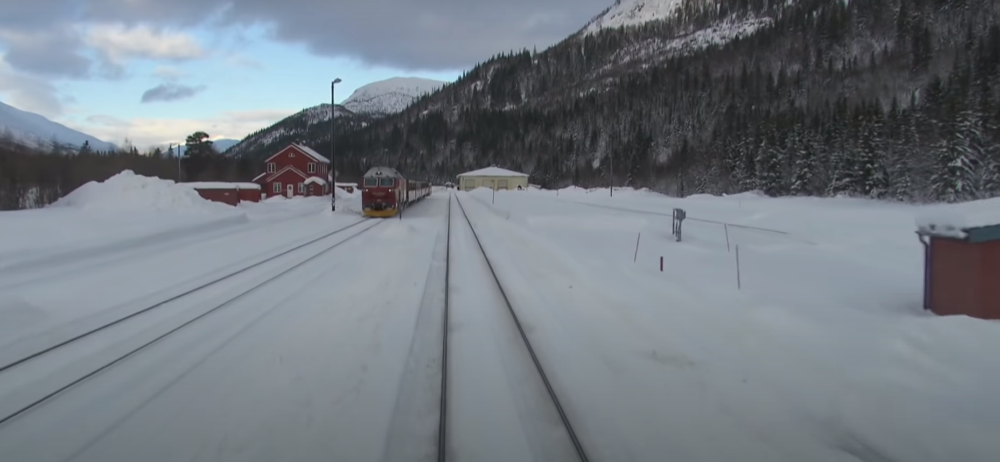
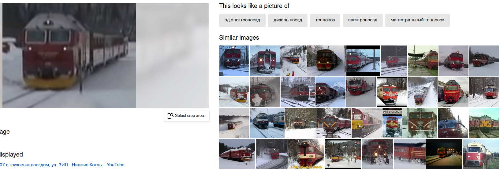
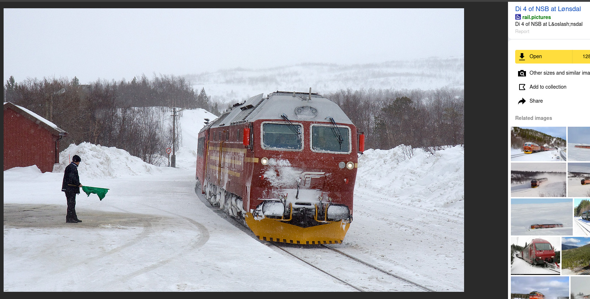
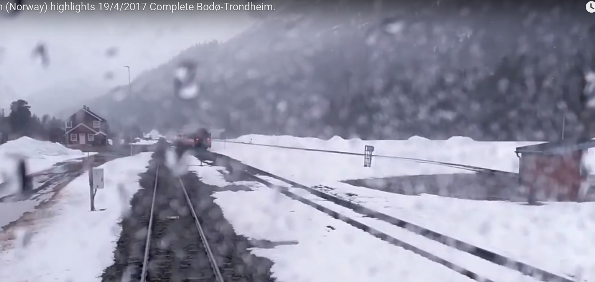
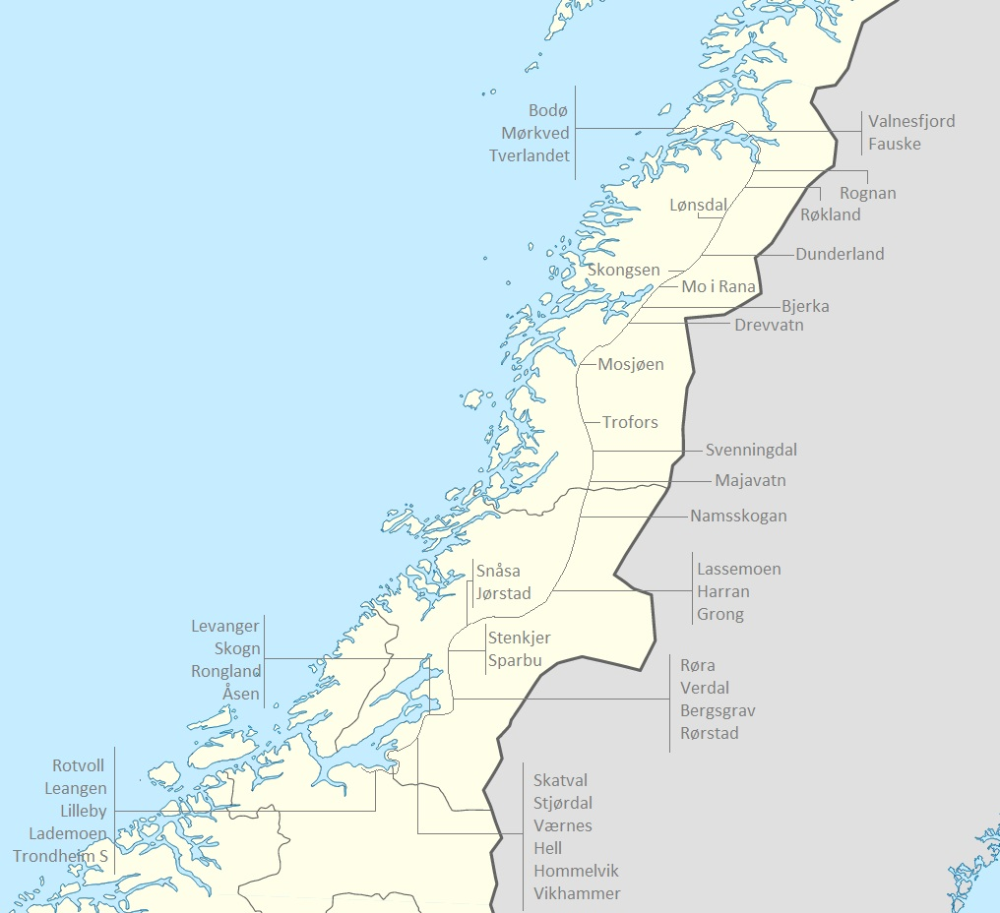
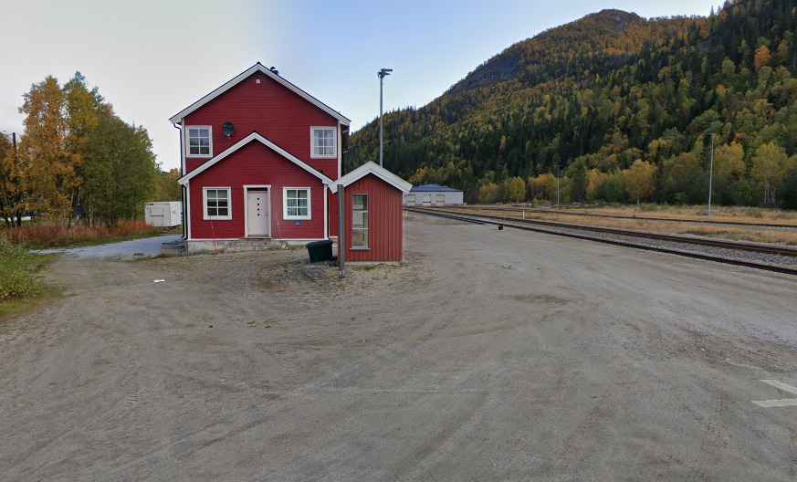
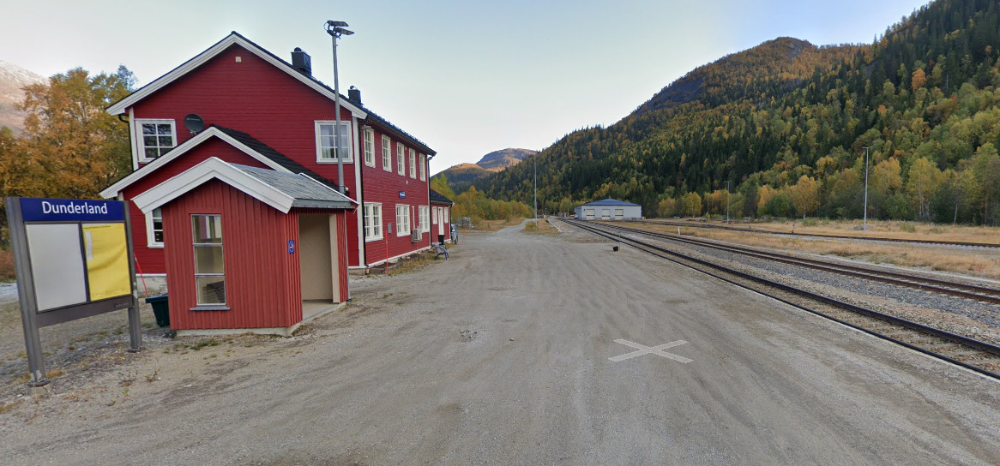

# Off the Rails 2: Electric Boogaloo: Far from Home - OSINT
### Description
Okay so I'm starting to think I may have got on the wrong train again and now it's snowing so hard I have no clue where I am 😬. Thankfully, I managed to snap this pic before the storm started. We seem to have stopped at this station.. can you tell me it's name?

Please tell me the name of the station in lower case flag format, with any spaces replaced by underscores.

### The Train

## Follow the Damn Train CJ
There is no interesting exif data and google images does not find this image. That means the challenge is literally unsolvable! Almost.
We can leverage the Russian power of YANDEX to find the exact train model!

So yeah. There are a lot of "Similar Images". Some of these look like the exact same train!

"Di 4 of NSB". Yeah, I'm pretty sure this is the train model. While searching for pictures of this train model, I saw a lot of snow and a lot of little red houses. It had to be it! Time for good ol' Wikipedia.

https://en.wikipedia.org/wiki/NSB_Di_4

`the class is used to haul passenger trains on the Nordland Line and are since 2001 the only revenue diesel locomotives used by NSB.`

Alright. Nordland Line. What I did now was pretty stupid but I fast-forwarded through a video of the whole Nordland line.
https://www.youtube.com/watch?v=0vDniy8DHD8

Here is a screenshot from 40:35.

Yeah, this HAS to be the place. But the video doesn't say the name of this station. 

### Finding the Station
So I went to the wikipedia page of the Nordland Line and used this picture as reference.

Then I went to Google Maps and... Just checked out every single station.  After a bit of searching, I saw this.

Yep, that's her. Has to be.

## THE FLAG
DUCTF{dunderland}
